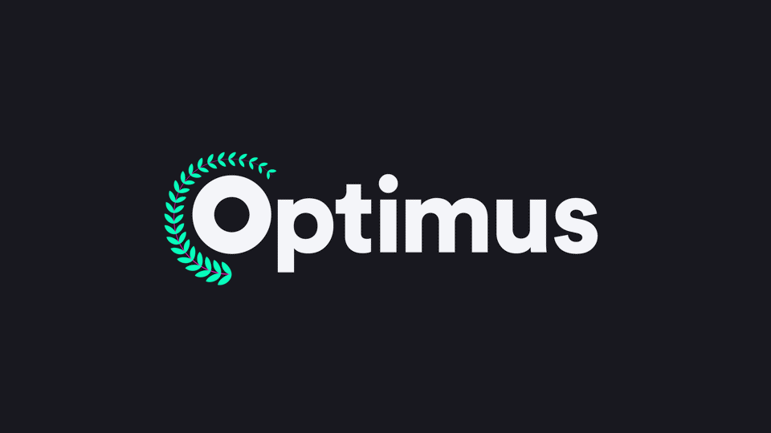
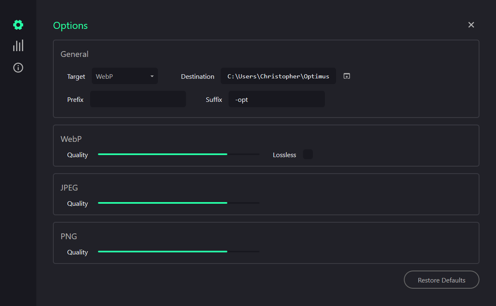

# Optimus

> Image compression, optimization and conversion desktop app.

## Overview

Optimus is a desktop image optimization application. It supports conversion and compression between WebP, JPEG, and PNG image formats.

## Features

- Convert to and from JPEG, PNG, and WebP formats.
- Compress JPEG, PNG (lossy), and WebP (lossy and lossless) formats.
- View simple stats on session and all-time use.

## Installation

### Downloads

Download the latest version from the [releases page](https://github.com/Splode/optimus/releases).

Optimus is available for Windows, macOS, and Linux.

## Development

Optimus is built using [Wails](https://wails.app/) and uses JavaScript on the frontend and Go on the backend.

Take the following steps to develop locally:

1. Clone the repo
2. Install Wails
3. Install go and npm dependencies

## License

MIT &copy; 2020 Christopher Murphy
